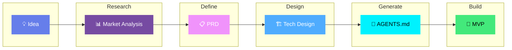

<p align="center">
  
</p>

<h3 align="center">AI-Powered MVP Development</h3>

<p align="center">
  <strong>Build an MVP in hours, not months — guided by AI coding agents</strong>
</p>

<p align="center">
  <a href="LICENSE"></a>
  <a href="http://makeapullrequest.com"></a>
  <a href="https://github.com/KhazP/vibe-coding-prompt-template/stargazers"></a>
  <a href="https://github.com/KhazP/vibe-coding-prompt-template/issues"></a>
</p>

<p align="center">
  
  
  
  
  
</p>

---

## 📖 Table of Contents
- [🚀 The Workflow Overview](#-the-workflow-overview)
- [🏁 Quick Start & The 5 Steps](#-quick-start--the-5-steps)
- [🛠️ Prerequisites & Tools](#️-prerequisites--tools)
- [🧠 Advanced Agent Best Practices](#-advanced-agent-best-practices)
- [🏗️ Structure & Deployment](#-final-project-structure--deployment)
- [💡 Common Pitfalls & Troubleshooting](#-common-pitfalls--troubleshooting)

---

## 🚀 The Workflow Overview

Transform any app idea into working code through 5 AI-powered stages:



<p align="center">
  <a href=".claude/README.md">
    
  </a>
  <a href="https://vibeworkflow.app/#/vibe-coding">
    
  </a>
</p>

---

## 🏁 Quick Start & The 5 Steps

> **TL;DR:** 📄 1. Copy Prompt → 💬 2. Answer Questions → 💾 3. Save Docs → 🤖 4. Feed to Agent → 🚀 5. Ship!

### 🟢 Phase 1: The "Thinking" Phase (Web Chatbots)
*Do these first 3 steps in ChatGPT, Claude.ai, Gemini, or an IDE. You don't need a code repository yet.*

###  Deep Research
<details open>
<summary><b>Validate your idea with AI-powered market research</b> — 20-30 min</summary>

**What this does:** Analyzes market opportunity, competitors, and tech feasibility.

1. Open [`part1-deepresearch.md`](part1-deepresearch.md) and **copy all of its contents**.
2. **Paste it** into your preferred AI platform Chat (like Claude.ai, ChatGPT, or Gemini) and press **Enter**.
3. The AI will ask you a few questions about your idea. Answer them truthfully in the chat.
4. The AI will generate a comprehensive research document based on your answers.
5. **Save the output** into a local file named `research-[YourAppName].txt` or simply **keep this chat open** for Step 2.

> **💡 Tip:** If your platform supports web search, enable it for up-to-date stats and competitor info.
</details>

###  Product Requirements (PRD)
<details open>
<summary><b>Define exactly what you're building</b> — 15-20 min</summary>

**What this does:** Transforms your idea into clear, actionable specs.

1. Copy the contents of [`part2-prd-mvp.md`](part2-prd-mvp.md).
2. **Option A (Same Chat):** If you kept your chat open, paste the prompt right below the Deep Research output.
3. **Option B (New Chat):** Start a fresh chat, paste your saved `research-[YourAppName].txt` content, and then paste the Part 2 prompt below it.
4. Press Enter, answer any clarifying questions the AI asks, and let it generate your requirements.
5. **Save the final output** as `PRD-[YourAppName]-MVP.md`.
</details>

###  Technical Design
<details open>
<summary><b>Plan the technical architecture</b> — 15-20 min</summary>

**What this does:** Decides the best tech stack and implementation approach.

1. Copy the contents of [`part3-tech-design-mvp.md`](part3-tech-design-mvp.md).
2. Paste it into your **ongoing conversation** (or into a new one, making sure to attach the `PRD-[YourAppName]-MVP.md` from Step 2 as context).
3. The AI will ask questions regarding your budget, timeline, and complexity tolerance.
4. Discuss the trade-offs it presents (e.g., full-code vs. no-code builder).
5. Once a stack is decided, **save the output** as `TechDesign-[YourAppName]-MVP.md`.
</details>

### 🔵 Phase 2: The "Execution" Phase (AI IDEs & CLIs)
*Transition to Cursor, VS Code with Copilot, or Claude Code. This is where your code gets written.*

###  Scaffolding the Agent Contracts
<details open>
<summary><b>Configure your AI IDE for Agentic execution</b> — 1-2 min</summary>

**What this does:** Automates the creation of `AGENTS.md` and memory constraints.

1. Click **"Use this template"** in GitHub (or clone this repository locally).
2. Open this cloned repository folder in your **AI IDE** (like Cursor or VS Code).
3. Upload/move the formatting documents you saved (`PRD.md` and `TechDesign.md`) into your IDE.
4. Open the AI Chat inside your IDE, type: *"Read [`part4-notes-for-agent.md`](part4-notes-for-agent.md), follow its instructions, and set up my workspace."*
5. Look at your files! The AI will automatically copy the pre-made boilerplates out of the `/templates/` directory to the root of your project, and intelligently fill in all the brackets based on your PRD constraints.
</details>

###  Build with AI Agent
<details open>
<summary><b>Let AI build your MVP</b> — 1-3 hrs</summary>

Choose your development environment and unleash your agent:

1. Ensure your newly generated `AGENTS.md` and configuration files are physically in the project folder.
2. Give your agent its **first command:** 
   > *"Read AGENTS.md, propose a Phase 1 plan, wait for my approval, and then build it step by step."*
3. Treat the agent like a junior developer. Ask it to stop and test after each major feature. Fix simple console errors before moving on.
4. **Repeat the loop** until your MVP is complete:

**Recommended Loop:**
```text
╭──────────────╮      ╭──────────────╮      ╭──────────────╮
│   📝 Plan    │ ───>│  ⚡ Execute │ ───>│  🔍 Verify  │
│  (Approve)   │      │  (One Feat)  │      │    (Test)    │
╰──────────────╯      ╰──────────────╯      ╰──────────────╯
       ▲                                           │
       └───────────────────────────────────────────┘
```
</details>

---

## 🛠️ Prerequisites & Tools

> **Basic Requirements:** Any modern browser, 2-4 hours of time, and basic computer skills (no coding required).

### Platform Selection Guide

| Focus Area | Recommended Tools |
|------------|-------------------|
| **Fast Prototype (Full-stack)** |  (Includes Agent/Plan mode, DB, Auth) |
| **Production-Ready Frontend** |  (Vercel-native, exact Next.js/React components) |
| **Learning / Sandbox Coding** |  (Dynamic Context) or VS Code with Copilot |
| **Complex Logic / Multi-Agent** |  (Agent Teams) or GitHub Copilot CLI |
| **Budget-Limited** |  (Free) + VS Code |

*Note: Avoid these tools for native mobile/hardware builds, regulated workloads (SOC2, HIPAA), or safety-critical systems.*

---

## 🧠 Advanced Agent Best Practices

<details open>
<summary><b>1. Artifact-First Memory & Compaction 🔄</b></summary>

To avoid context overload, modern agents rely on **artifact-first memory** instead of infinite chats:
- **Compaction & Handoffs:** Use native compaction (`/compact` in Copilot CLI, Claude Code logic) instead of hard resets. When swapping sessions, have the agent write a `001-spec.md` or `recap.md` and load ONLY that file into the new chat.
- **Dynamic Context (Cursor):** Let the agent write its findings into physical files rather than keeping them raw in the chat history.
- If you must restart, attach `AGENTS.md`, `PRD.md`, and your latest spec file.
</details>

<details open>
<summary><b>2. Multi-Agent Orchestration & Plugins 🤖</b></summary>

- **Agent Teams:** Tools like Claude Code support multiple agents working in parallel (e.g., Team Lead + Teammates). Treat your workflows like squad assignments.
- **Plan-Before-Edit:** Always demand an approved plan from the lead agent before allowing the execute agent to touch code. This prevents silent regressions.
- Keep `AGENTS.md` as the source of truth, then add tool-specific plugins or `.cursor/rules/` to seamlessly extend capabilities.
</details>

<details>
<summary><b>3. Model Strategy Matrix 🧠</b></summary>

Use model families instead of pinned version names for better stability as models rotate.

| Strategy | Primary Families | Best For | Speed |
|----------|------------------|----------|:-----:|
| Speed-first | Gemini Flash, Claude Sonnet | Fast prototyping, broad iteration | High |
| Balanced | Claude Sonnet, Gemini Pro | Daily coding, debugging, planning | Med-High |
| Depth-first | Claude Opus, Gemini Pro | Deep reasoning, complex refactors | Medium |
</details>

<details>
<summary><b>4. Agent Observability 🔍</b></summary>

When an agent ignores instructions or behaves inconsistently:
1. Check which instructions/rules/hooks were loaded.
2. Confirm tool permissions and blocked actions.
3. Verify the active session context was not reset.
4. Re-run with explicit instruction order: *"Read AGENTS.md, then agent_docs/, then execute."*
</details>

---

## 🏗️ Final Project Structure & Deployment

### Recommended Project Skeleton
```
your-app/
├── 📁 docs/
│   ├── research-YourApp.txt
│   ├── PRD-YourApp-MVP.md
│   └── TechDesign-YourApp-MVP.md
├── 📁 agent_docs/
│   └── tech_stack.md, project_brief.md, testing.md
├── 📄 AGENTS.md                  # Universal AI instructions (The Master Contract)
├── 📁 specs/                     # Agent handoff artifacts (e.g. 001-feature-spec.md)
├── 📁 .cursor/rules/             # Cursor rules (preferred)
└── 📁 src/                       # Your application code
```

### Deployment & Security

Once your MVP is built, run your final security checks and deploy:

1. **Security Pass:** Check dependencies, secrets, auth paths, and rate limits.
2. **Push & Deploy:**
   -  For Next.js, React, frontend apps.
   -  For Static sites, edge functions.

---

## 💡 Common Pitfalls & Troubleshooting

<details>
<summary><b>Avoid these mistakes ⚠️</b></summary>

| Pitfall | Solution |
|---------|----------|
| Skipping discovery work | Run the Part 1 research prompt first |
| Letting agents ship code alone | Review the diff and run tests before merging |
| Publishing auto-generated UIs | Test accessibility and security before launch |
| Forcing one tool to do everything | Mix tools — IDE + terminal + builder |

</details>

<details>
<summary><b>Agent Troubleshooting 🔧</b></summary>

| Problem | Solution |
|---------|----------|
| **"AI ignores my docs"** | Say: *"First read AGENTS.md, PRD, and TechDesign. Summarize key requirements before coding."* |
| **"Code doesn't match PRD"** | Say: *"Re-read the PRD section on [feature], list acceptance criteria, then refactor."* |
| **"AI is overcomplicating"** | Add to config: *"Prioritize MVP scope. Offer the simplest working implementation."* |
| **"Deployment failing"** | Request: *"Walk through deployment checklist, verify env vars, then run health check."* |

</details>

---

## Monthly Update Cadence
This template is maintained monthly. Review model/tool deprecations, refresh doc references to model families, and update agent capabilities.

## Contributing

<p align="center">
  <a href="https://github.com/KhazP/vibe-coding-prompt-template/graphs/contributors">
    
  </a>
  <a href="https://github.com/KhazP/vibe-coding-prompt-template/network/members">
    
  </a>
</p>

PRs and issues welcome! Share your success stories, add new tool configurations, or submit example MVPs. See [CONTRIBUTING.md](CONTRIBUTING.md) for guidelines.

---

## License

Released under the [MIT License](LICENSE).

---

<p align="center">
  <strong>The best time to build your idea was yesterday. The second best time is now.</strong>
</p>

<p align="center">
  <sub>Created by the vibe-coding community</sub>
</p>

<p align="center">
  <a href="#the-workflow-overview">
    
  </a>
</p>
